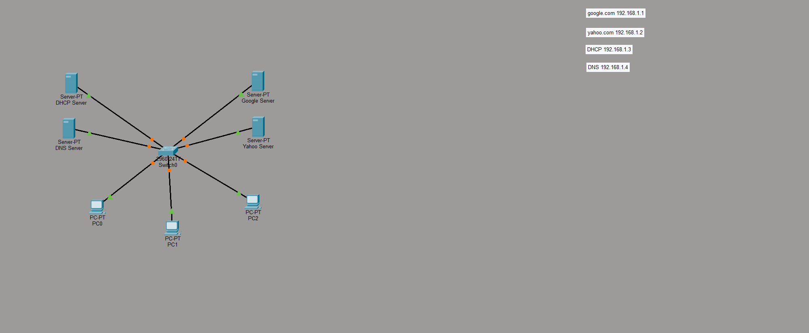

Small LAN IP Addressing and Server Topology Lab

Project Overview

This Cisco Packet Tracer lab was created to practice designing a basic local area network and assigning IP addresses to several network servers.

The topology connects three client computers and four servers through a central Cisco 2960 switch. Each server represents a different network service, including DHCP, DNS, and HTTP web hosting.

Network Topology

Devices Used

| Device            | Quantity | Purpose                                       |
| ----------------- | -------: | --------------------------------------------- |
| Cisco 2960 Switch |        1 | Connects all devices within the LAN           |
| Client Computers  |        3 | Represent users accessing network services    |
| DHCP Server       |        1 | Represents automatic client addressing        |
| DNS Server        |        1 | Represents domain name resolution             |
| HTTP Web Servers  |        2 | Represent simulated Google and Yahoo websites |

Server Addressing

| Server            | IP Address    |
| ----------------- | ------------- |
| Google Web Server | `192.168.1.1` |
| Yahoo Web Server  | `192.168.1.2` |
| DHCP Server       | `192.168.1.3` |
| DNS Server        | `192.168.1.4` |

Lab Scope

This lab focused primarily on creating a basic LAN topology, connecting end devices through a switch, assigning server roles, and organizing IP addresses within the `192.168.1.x` network.

The topology provides a foundation for future testing of DHCP address assignment, DNS resolution, HTTP access, and client connectivity.

