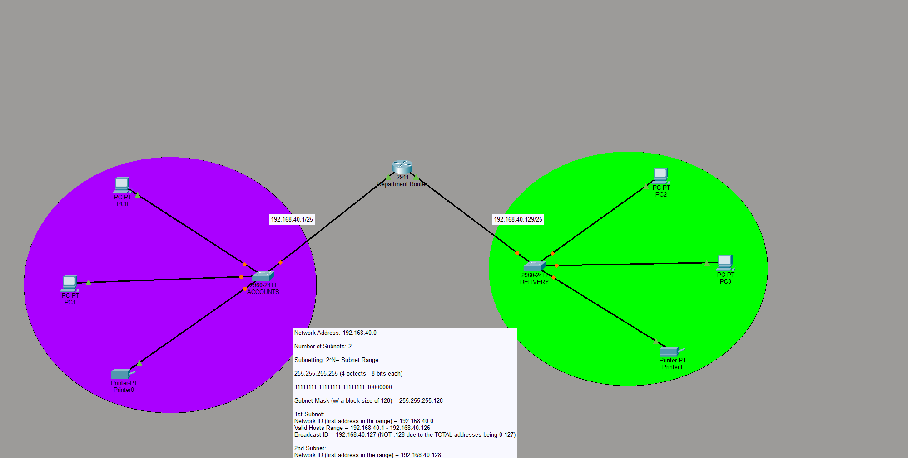

# Office Network Subnetting Lab

## Project Overview

This Cisco Packet Tracer lab demonstrates how one private network can be divided into two departmental subnets. The Accounts and Delivery departments each use a dedicated switch, two workstations, and a network printer. A Cisco 2911 router connects the two departmental networks.

## Network Topology

## Devices Used

| Device | Quantity | Purpose |
| --- | ---: | --- |
| Cisco 2911 router | 1 | Connects the departmental subnets |
| Cisco 2960 switches | 2 | Connect local devices within each department |
| Client computers | 4 | Represent departmental users |
| Network printers | 2 | Provide a shared printer for each department |

## Addressing Plan

The original `192.168.40.0/24` network was divided into two `/25` subnets using the subnet mask `255.255.255.128`.

| Department | Network | Usable Host Range | Broadcast | Router Address |
| --- | --- | --- | --- | --- |
| Accounts | `192.168.40.0/25` | `192.168.40.1` through `192.168.40.126` | `192.168.40.127` | `192.168.40.1` |
| Delivery | `192.168.40.128/25` | `192.168.40.129` through `192.168.40.254` | `192.168.40.255` | `192.168.40.129` |

## Configuration Completed

The topology separates Accounts and Delivery into distinct IP networks. Each department has its own access switch, workstations, printer, and router interface. The addressing plan provides up to 126 usable host addresses per department.

## Skills Demonstrated

This lab demonstrates IPv4 subnetting, subnet mask calculation, departmental network segmentation, router and switch placement, IP address planning, and basic office network design.

## Project File

Open [Office_Network_Practice.pkt](Office_Network_Practice.pkt) with Cisco Packet Tracer to review the topology and device configurations.
