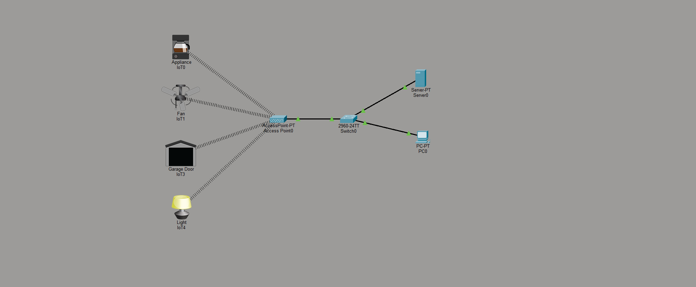

# IoT Network and Server Lab

## Project Overview

This Cisco Packet Tracer lab demonstrates a small Internet of Things network. Wireless smart devices connect through an access point, while a server and workstation connect through a Cisco 2960 switch. The design shows how IoT devices can share a local network with traditional wired systems.

## Network Topology

## Devices Used

| Device | Quantity | Purpose |
| --- | ---: | --- |
| Wireless access point | 1 | Connects the IoT devices to the local network |
| Cisco 2960 switch | 1 | Connects the access point, server, and workstation |
| Server | 1 | Represents centralized network services |
| Client computer | 1 | Represents a local management workstation |
| Smart appliance | 1 | Wireless IoT endpoint |
| Smart fan | 1 | Wireless IoT endpoint |
| Smart garage door | 1 | Wireless IoT endpoint |
| Smart light | 1 | Wireless IoT endpoint |

## Configuration Completed

The access point provides wireless connectivity for four smart devices. Its wired connection to the switch places those devices on the same local infrastructure as the server and workstation. This creates a basic topology for centralized IoT connectivity and management.

## Skills Demonstrated

This lab demonstrates IoT topology design, wireless endpoint connectivity, access point integration, switched network design, server placement, and the connection of wired and wireless devices within one local network.

## Project File

Open [IoT_Server_Practice.pkt](IoT_Server_Practice.pkt) with Cisco Packet Tracer to review the topology and device configurations.

## Validation Note

The included screenshot documents the completed topology. Detailed ping results, addressing tables, and automation rules were not captured for this version of the lab.
